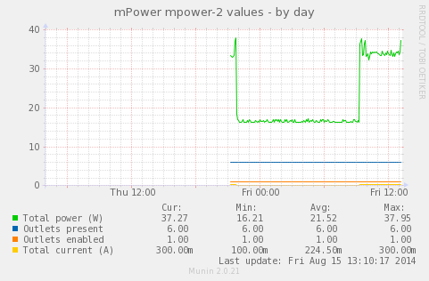

munin-mpower
============

Munin plugin for mPower devices allows for graphing:

- Total power usage by all outlets (`power`)
- Total number of outlets for the device (`outlets`)
- Number of outlets marked enabled (collecting data for mFi) (`enabled`)
- energy.info Total energy (kWh) used by all outlets (`energy`)
- current.info Current (A) usage by all outlets (`current`)
- Average voltage (V) across all outlets (`voltage`)

Sample output of mPower Pro powering a ToughSwitch, Edgerouter POE,
and in the morning a laptop. Configured with

```
env.voltage no
env.energy no
```


